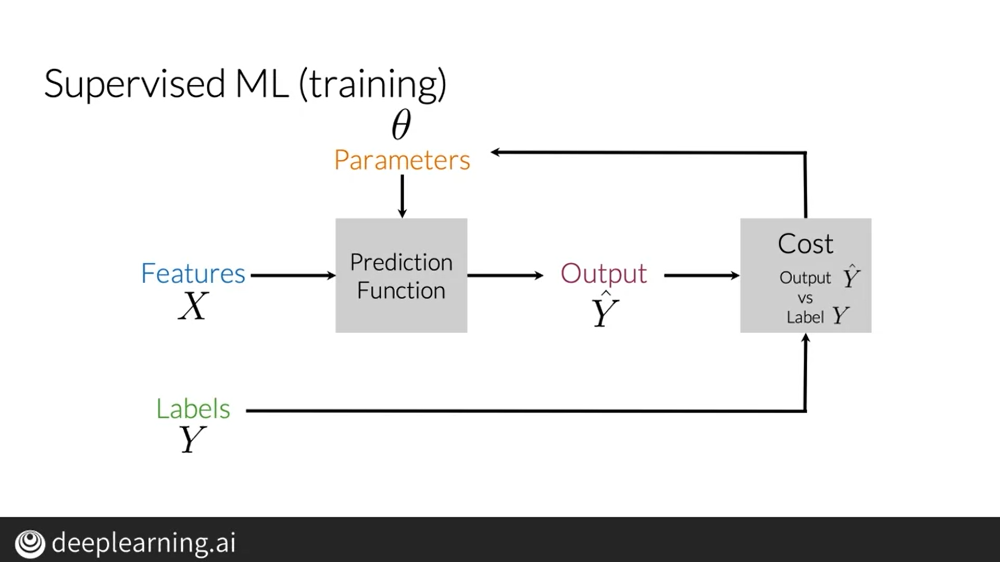

## Supervised Machine Learning & Sentiment Analysis

###### Supervised Machine Learning

- **Input:** A set of samples with a set of features ($X$) and labels ($y$).
- **Goal**: Minimize the model error based on predictions and labels.
- **Approach:** Construct a prediction function (i.e. model) with parameters $\theta$ that maps input features ($X$) to predictions ($\hat{y}$) and update function parameters to minimize the error (i.e. cost function) between $y$ and $\hat{y}$.
- **Cost Function:** A cost function compares $y$ and $\hat{y}$ and quantifies how similar they are. 
- A high level representation of model training in supervised ML:

**Sentiment Analysis:** The task of predicting if a piece of text is positive or negative. In this course, we label positive texts with 1 and negatives with 0. We will build a **logistic regression** (LR) model, a type of prediction function, by extracting features from a set of tweets annotated with positive or negative labels and minimizing a cost function (*training*). Consequently, we will have a model capable of predicting whether a text is negative or positive. 

